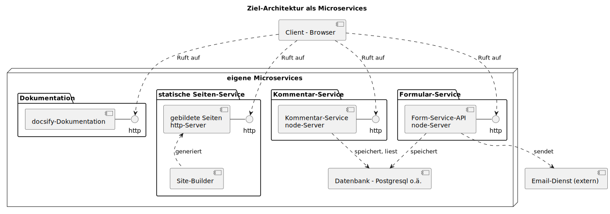

# Projektarbeit M347

Ziel dieses Moduls ist es, Ihnen die "**Container-Architektur**" näherzubringen.
Wir bauen dazu eine **monolithische** Beispiel-Applikation zu mehreren Einzeldiensten,
so genannten **Microservices**, um.

Dies werden wir im Laufe des Semesters schrittweise tun, im Rahmen eines übergreifenden Projektes, welches
Sie am Schluss als "Gesamtpaket" als Projektarbeit abliefern.

## Ziel des Gesamtprojektes

Wir bauen auf Ihrem **Webseiten-Projekt aus dem Modul M293** auf: Ziel ist, dass Sie Ihre Webseite folgendermassen ausbauen:

* Ihre Webseite wird aus **Templates (11ty) als statische Webseite gebildet**
* Ihre Webseite wird von einem **Frontend-Webservice** ausgeliefert
* Ihre Webseite beinhaltet ein **Feedback-Formular**. Diese Feedbacks werden per **Mail** an eine Mailbox versandt, und
  **in einer Datenbank** gespeichert.
* Ihre Webseite kann **Kommentare pro Detailseite** (z.B. Rückmeldung zu einem bestimmten Produkt) erfassen und anzeigen.
  Diese Kommentare werden pro Detailseite in einer Datenbank festgehalten und wieder an der korrekten Stelle (Seite) ausgeliefert.
* Die einzelnen Dienste sollen als **Container-Dienste** umgesetzt und miteinander verknüpft werden.
* Sie **dokumentieren** die Gesamt-Architektur in einer `docsify`-Dokumentationsseite.

Wir erarbeiten dazu gemeinsam die notwendigen Kenntnisse, während dem Sie die finale Funktionalität dann selber
erarbeiten und als Projektarbeit abgeben.

## Ausgangslage

Wir beginnen mit einer monolithischen Architektur: Ein Server "macht alles": Frontend, Backend, Datenbank. Sie erhalten eine
kleine Beispiel-Applikation mit folgenden Komponenten:


* Sie erhalten von mir eine kleine **Web-Applikation** auf Basis **NodeJS** / **ExpressJS** (`monolith/server.js`).
* Dieser liefert:
	*  Ihre **statischen Seiten** (alles unter `[site]/`, also z.B. `http://localhost:3000/index.html`, oder auch `http://localhost:3000/images/bild1.png`)
	* ein Formular-HTTP-Endpunkt `/feedback`: Dieser nimmt
		Formular-Daten entgegen und sendet den Inhalt an
		einen (Demo)-Maildienst
	* Einen API-Endpunkt für die **Erfassung** von Daten: `/api/save-text`: Dieser dient der Demonstration eines Backend-Dienstes, um Daten in einer Datenbank zu speichern
	* Einen API-Endpunkt für die **Auslieferung** von Daten: `/api/get-texts`: Dieser dient der Demonstration eines Backend-Dienstes, um Daten von einer Datenbank zu lesen

Ihre statischen Seiten erzeugen Sie mittels der aus M293 bekannten **statischen Site-Generator**-Architektur (11ty).

Dieser Server ist **monolithisch** umgesetzt, er implementiert also alle Funktionalitäten selber als einzige, grosse Applikation.

Ihr **Client**, also der Browser, macht nur Verbindung(en) zu diesem einen Server.

Daneben steht diese `docsify`-Seite als separate Applikation zur Verfügung.

## Ziel-Architektur

Diese monolithische Architektur überführen Sie im Verlauf des Projektes in einzelne **Micro-Services**:



Die monolithische Demo-Applikation `server.js` soll in einzelne, in Container
verpackte Apps aufgetrennt werden:

* ein **Frontend**-Dienst liefert Ihre statische Seite, also HTML, CSS und weiteren statischen Content, aus. Dazu wird ein einfacher Webserver wie z.B. [Apache HTTP](https://httpd.apache.org/) oder [Nginx](https://nginx.org/) verwendet.
* ein **Forms-Service** dient für die Entgegennahme Ihres Feedback-Formulars (NodeJS-ExpressJS-Service):
  Dieser Service soll:
	* den Formular-Inhalt an eine Mailadresse senden
	* den Formular-Inhalt in einer Datenbank-Tabelle zu Referenzzwecken speichern
* ein **Kommentar-Service** stellt ein **API** zur Verfügung, welche:
    * vorhandene Kommentare zu einer einzelnen Detailseite aus einer
	  Datenbank liest und dem Frontend als HTML-Snippet zur Verfügung stellt
	* Kommentare zu einer einzelnen Webseite entgegennehmen und in der
	  Datenbank speichern
* die **Datenbank** steht wahlweise als **sqlite-Datenbank pro Service** oder ebenfalls als zentraler Container-Dienst zur Verfügung.
* die **Dokumentation** steht weiterhin als Teil dieser Architektur zur Verfügung.

Wir werden im Laufe des Semester die notwendigen Handwerkzeuge kennen lernen.
**Es obliegt aber in Ihrer Verantwortung, die bestehende Applikation soweit auszubauen / zu ergänzen, damit die geforderte Funktionalität abgebildet werden kann!**

## Ihre Aufgabe

Wie oben aufgezeigt ist es Ihre Aufgabe, die fertig umgebaute Applikation abzuliefern. Im Detail heisst dies:

* Sie erstellen die verschiedenen Container-Dienste wie oben gezeigt:
    * **Frontend-Seiten-Auslieferung**: ein Container, der die statischen Seiten beinhaltet und ausliefert. Dazu verwenden Sie einen einfachen Webserver wie z.B. [Apache HTTP](https://httpd.apache.org/) oder [Nginx](https://nginx.org/).
    * **Forms/Feedback-Service**: ein Container, der die Feedback-API-Funktionalität umsetzt. **Das Speichern der Kommentare in der Datenbank müssen Sie als Teil der Projektarbeit noch selber umsetzen.**. Als Ausgangslage kann die monolithische Applikation dienen, die Sie umbauen / ergänzen können.
    * **Kommentar-Service**: ein Container, der die Kommentar-Funktion / API umsetzt. Diese Funktionalität müssen Sie als Teil der Projektarbeit selber umsetzen.
      **Ziel ist, dass Sie Kommentare pro Seite verwalten können**: Dazu muss Ihr Service Kommentare nach einem Identifikator ausliefern können.<br>
      **Beispiel:**
        - der GET-Aufruf "http://api/get-comments?id=produktseite" liefert Kommentare zu einer Produktseite
        - ein POST-Request nach "http://api/send-comment?id=produktseite" speichert einen Kommentar zur Produktseite
	* **Datenbank-Service**: **optional**: dieser Container stellt eine PostgreSQL-Datenbank zur Verfügung. Diesen Container erstellen wir im Verlauf des Semesters. Das notwendige Datenbank-Schema dazu müssen Sie als Teil der Projektarbeit selber umsetzen. **Sie können auf diesen Dienst verzichten, und die Daten jeweils in einer lokalen sqlite-Datenbank speichern.**
	* **docsify-Container**: Dieser Container stellt die laufende `docsify`-Dokumentation zur Verfügung, entweder als laufende Docsify-Applikation, oder ebenfalls als statische Seiten (`docsify build` als Stichwort).
* Sie erstellen die notwendigen Scripte / Compose-Files, um alle Dienste
	miteinander zu starten / zu koordinieren
* Sie liefern den gesamten Code inkl. dazu notwendiger Docker- und Compose-File und Dokumentation im **Classroom-Git-Repository** ab.
* Sie **dokumentieren** die Architektur und die einzelnen Dienste in der `docsify`-Dokumentation, welche ebenfalls Teil des Repositories ist.

## Abgabe

Sie geben den **gesamten Code inkl. Dokumentation, Konfiguration und Datenbank-Scripte** via gihub classroom-Repository ab. Ihr git-Repository sollte beinhalten:

* Die Dokumentation als `docsify`-Dokumentation und -Container (siehe unten)
* Alle Scripte, Dateien und Konfigurationen, um alle Container-Dienste
  zu bauen resp. zu starten:
  * Frontend-Container mit der statischen Webseite, welche den Forms-Service
    und den Kommentar-Service (pro Detailseite) nutzt
  * Forms-Container mit dem Forms-API für Mail + DB-Eintrag 
  * Kommentar-Container mit dem Kommentar-API
  * (optional) Datenbank-Container für die PostgreSQL/Maria/MySQL-Datenbank
  * Sorgen Sie dafür, dass die notwendigen Daten (z.B. Datenbank) **beim ersten Start Ihrer Applikationen automatisch korrekt erzeugt werden**
	* Für Postgres-Datenbank: Dazu gehört ein init-Script, welches das Datenbank-Schema beim Erstellen des Containers erzeugt (siehe <https://hub.docker.com/_/postgres/>, Abschnitt "Initialization Scripts")
  * docsify-Container, der die Dokumentation als Dienst bereitstellt, wahlweise als dynamische docsify-Applikation, oder als statisch gebildete Seiten (`docsify build` erzeugt auch statische Seiten)

Ihr Repository muss alles notwendige liefern, damit ich die Dienste starten kann.

Ich werde folgendes ausführen:

```sh
git clone /url/zu/ihrem/repo
cd [ihr-repo]
docker compose up
```

Danach müssen die Dienste alle gebaut sein und laufen, inkl. der notwendigen
Port-Weiterleitungen.

**Sollten Sie für den Setup spezielle Instruktionen liefern wollen, erwarte ich ein README.md-File im obersten Verzeichnis des Repositories!**

### Dokumentation

Ich erwarte eine Dokumentation in Form eines `docsify`-Markdown-Containers. Die Dokumentation zeigt von Ihrem Projekt folgendes:

* **Bedienungshinweise:**<br>
  Falls Ihre Applikation zum Erstellen / Builden / Starten spezielle Instruktionen benötigt, dokumentieren Sie diese.
  Dokumentieren Sie die einzelnen Kommandos, welche zum Starten der Applikation notwendig sind.
* **Diagramm und Beschreibung der Systemarchitektur:**<br>
  Sie zeigen eine schematische Darstellung der gesamten Systemarchitektur. Es muss ersichtlich sein, welche Systeme / Dienste
  vorhanden sind und welche wie miteinander kommunizieren. **Dazu gehören ensprechende Diagramme UND eine textuelle Beschreibung der Dienste und deren Funktionen.**
* **Beschreibung der einzelnen Dienste**:<br>
  Beschreiben Sie die Funktion und die genutzten Technologien der einzelnen Dienste und deren Aufgabe im Gesamtsystem.
* **Beschreiben der eingesetzten Container-Technologien:**<br>
  Beschreiben Sie, welche Container welche Container-Technologien benutzt, und warum:
  * Welche Dienste benötigen Bound Volumes, welche benötigen Docker-Volumes? Warum?
  * Welche Dienste benötigen ein Docker-Network, und wie haben Sie dieses konfiguriert?
  * Welche Dienste exponieren Netzwerk-Ports "gegen aussen", und warum?
  * Wie / über welche "Kanäle" kommunizieren die Container untereinander?
  * Wie erstellen Sie die Images der einzelnen Container?
* **Dokumentation der verwendeten Docker-Kommandos**<br>
  Während des Semesters und im Laufe der Projektarbeit haben Sie ganz viele Docker- und Docker-Compose-Kommandos kennengelernt. Picken Sie sich **3** davon aus, und **dokumentieren Sie die gelernten/im Projekt verwendeten Kommandos (z.B. `docker run`)**:
    * Name des Kommandos
    * Beschreibung: Was macht es, wann / wo wird es benötigt?
    * ein (vollständiges) Beispiel des Kommandos für Ihr Projekt

## Bewertung

**ICT LBV Modul 347-1 LB 2 - 60% der Modulnote**

(siehe https://gitlab.com/ict-modulformation-ch/module/m347/lbv-m-347-1)

Die Bewertung erfolgt mittels separatem Bewertungsblatt, welches via Moodle abgegeben wird / ersichtlich ist.
